# flutterfire01

# Campus Maintenance Tasker 
- Flutter Elective Final Exam Project
- A full-stack maintenance management system built with Flutter and Firebase. This application includes the process of reporting campus issues, assigning staff to assignments based on the assigned facility locations, and tracking work progress through real-time logs.

# Live Application (Backend Link)
- URL: https://campusmaintenance-f1b6e.web.app

# Core Features

# Facility-Specific Staffing:
Implemented a constraint-based system where Staff are manually assigned to specific Facilities. When a report is filed for a building, the system automatically filters the available workforce to only allow assigned staff to accept the task.

# Work Order Management:
- Comprehensive CRUD operations for maintenance tasks, including status updates from "Pending" to "Working" to "Completed."

# Automated Activity Logs:
- Every work order maintains a history of actions performed by Admins, Staff, or the System.

# Multi-Role Access: 
- Managed views for Users (Reporting), Staff (Execution), and Admins (Management).

# Tools:
- Frontend: Flutter Web (Dart)

- Backend: Firebase Auth & Cloud Firestore

- Hosting: Firebase Hosting

# Project Structure
- lib/models/: Data structures for Facilities, Staff, and Work Orders.

- lib/services/: Firebase Firestore logic and Auth services.

- lib/screens/: UI components for the different user roles.

- firebase_options.dart: Project configuration (Automated via FlutterFire).

# Project Screens

# Landing Page Screen:
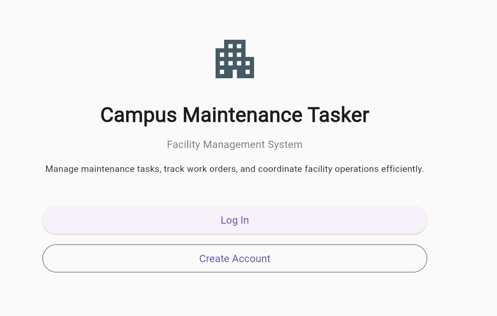

# Create Account Screen:
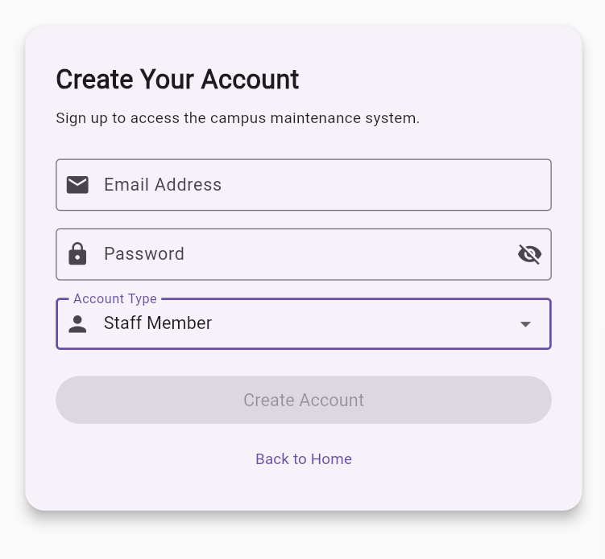

# Log In Screen:
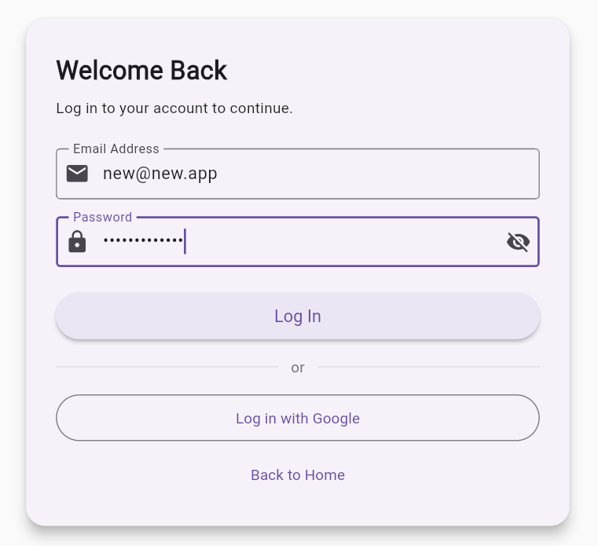

# Dashboard Screen:
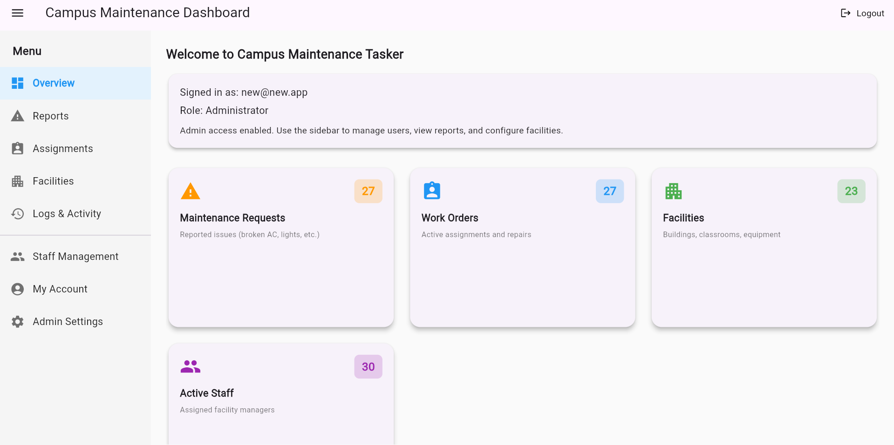

# Admin Settings Screen:
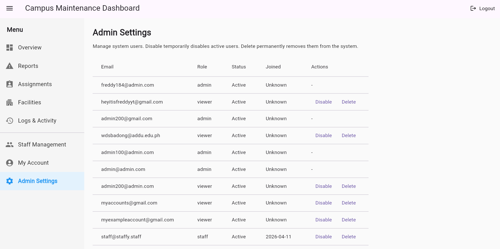

# MyAccount Screen:
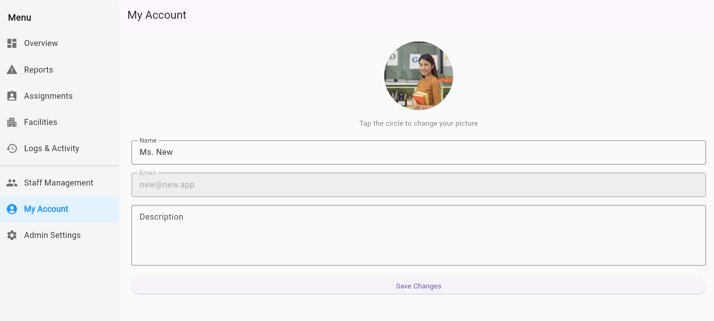

# Staff Management Screen:
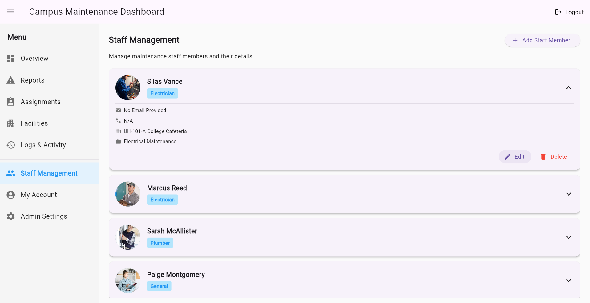

# Facility Screen:
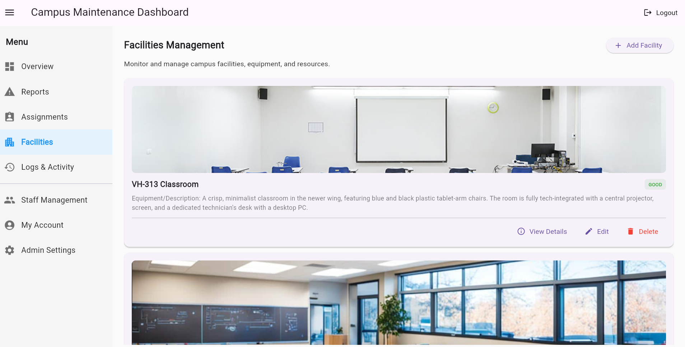

# Reports Screen:
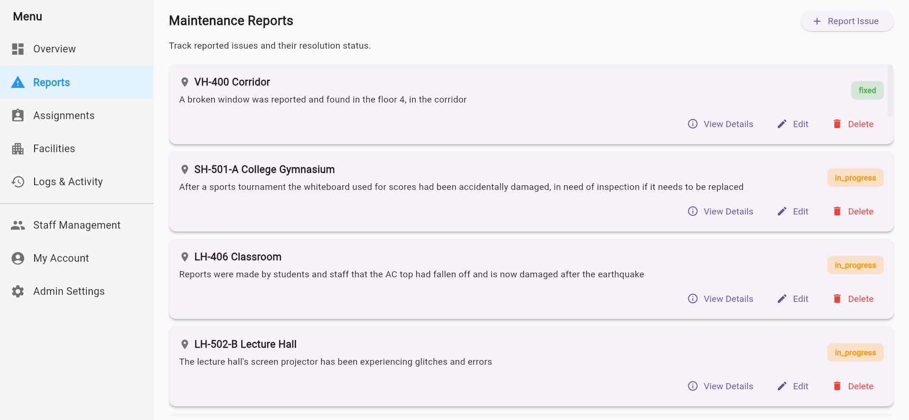

# Assignments Screen:
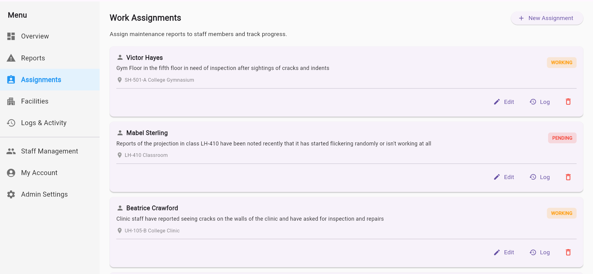

# Logs Screen:
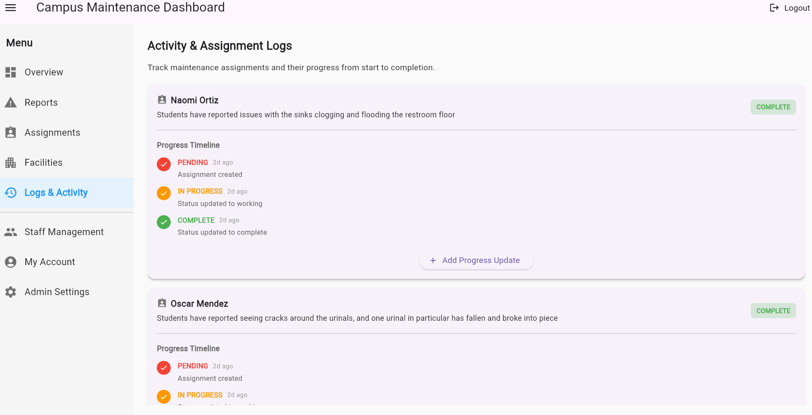

# Final Note
This project was developed as part of the Flutter elective final exam.
